# openDesk Community of Practice — 19. Juni 2026

- **Datum**: Freitag, 19. Juni 2026 | **Zeit**: 14:00–15:30 CET
- **Ort**: [BigBlueButton](https://webconf.hrz.uni-marburg.de/n/rooms/7gq-zdy-zje-roq/join)
- **Repo**: [github.com/opendesk-edu/cop](https://github.com/opendesk-edu/cop) — [codeberg.org/opendesk-edu/cop](https://codeberg.org/opendesk-edu/cop)

---

## Agenda

| Zeit | Dauer | Punkt |
|------|-------|-------|
| 14:00 | 5′ | **1. Begrüßung & Einführung** |
| 14:05 | 25′ | **2. Betrieb & Lessons Learned** — ILIAS, OIDC, Backup, Monitoring, HRZ-Issues |
| 14:30 | 15′ | **3. Upstream & Cluster-Status** — openDesk 1.16.0, Komponenten, Cluster |
| 14:45 | 15′ | **4. Bildungssektor** — edu-Dienste, Roadmap, neue Anforderungen |
| 15:00 | 15′ | **5. Offener Austausch** — Freie Diskussion, Fragen |
| 15:15 | 5′ | **6. Wrap-Up & Action Items** — Nächstes Datum, To-Dos |
| 15:20 | ~10′ | *Puffer / Überlauf* |

---

## 1. Begrüßung & Einführung — 5′ (14:00–14:05)

- Vorstellungsrunde (wer ist neu?)
- Hinweis: BBB-Raum dauerhaft für dieses Format
- Kurz-Recap letzte CoP
- Agenda für heute

---

## 2. Betrieb & Lessons Learned — 25′ (14:05–14:30)

### a) ILIAS-Stabilisierung

**Problem**: MariaDB `Connection refused` bei neu erstellten Pods (ILIAS-Cronjobs).  
**Fix**: 5-facher Retry-Loop mit 10s Pause im Cronjob — läuft seitdem stabil.

**Offen**:
- Weitere Fehlerbilder im ILIAS-Betrieb?
- Neuere ILIAS-Version getestet?
- Upgrade-Pfad dokumentiert?

### b) OIDC / SSO

**Bisher eingerichtet**:
- Keycloak Realm `opendesk` als zentraler IdP
- SOGo (Client-ID `sogo`) und **Planka** (Client-ID `planka`) registriert
- `email` + `preferred_username` Mapper aktiv
- Verwaltung via `kcadm.sh` auf `ums-keycloak-0` (User: `kcadmin`)

**Fragen**:
- Nächste Dienste für OIDC? OpenProject? Nextcloud? Etherpad?
- Erfahrungen mit SAML vs OIDC?

### c) Backup-Infrastruktur (k8up)

| Aspekt | Status |
|--------|--------|
| Operator | k8up v2.13.0 |
| Ziel | s3://s3.hrz.uni-marburg.de/backups |
| Aktiv gesichert | 6 RWX-PVCs (clamav, dovecot, opencloud, seaweedfs, slidev) |
| Exkludiert | 29 RWO-PVCs (`k8up.io/exclude: true`) |

**Offen**: RWO-PVCs brauchen eigene Strategie (CSI-Snapshots? Per-Node-Schedules?).

**Production-Hardening (Vorschlag)**:
- **Tier A** (kritisch): Keycloak, PostgreSQL, Redis, MariaDB, MinIO → RPO 1h, RTO 2h, 30d Retention
- **Tier B** (wichtig): Nextcloud, OX, OpenProject, ILIAS, Moodle → RPO 1h, RTO 4h, 14d
- **Tier C** (experimentell): JupyterHub, Ollama, Dask → RPO 24h, RTO 1d, 7d

**Historisch**: Feb 2026 — 6 Backup-Pods stuck (10h), Fix: PodConfigRef entfernt.

### d) Monitoring

| Komponente | Metriken | Alerts | Dashboard |
|-----------|----------|--------|-----------|
| Collabora | ✅ | ✅ | ✅ |
| Nextcloud | ✅ | ❌ | ❌ |

**Lücken**: Backup-Health-Dashboards, Ressourcen-Alerts (CPU >80%, Memory >85%, Disk >80%), PrometheusRules teilweise deployed.

**Frage**: Welche Dashboards werden im Alltag vermisst?

### e) Known HRZ Issues

| Problem | Status | Workaround |
|---------|--------|------------|
| DNS CNAME-Ketten | CoreDNS → SERVFAIL | `hostAliases` in Deployments |
| Nextcloud AIO Probe-Bug | initialDelaySeconds falsch | in Chart patchen |
| Planka Ingress | hartcodiert `nginx` | Annotation entfernen |
| Grafana Ingress-Class | Default nginx | auf haproxy umstellen |
| ClamAV ICAP-Restartloop | 137 Rests, stale Socket | Container cleanup |
| k8up RWO-PVCs | Backup-Pod kann nicht mounten | Exkludiert |

### f) Diskussion — Was lief gut? Was nicht?

- Letzter Sprint — Highlights, Pain Points
- Prioritäten für den nächsten Sprint

---

## 3. Upstream & Cluster-Status — 15′ (14:30–14:45)

### openDesk 1.16.0 (nächste Version)

> **Hinweis**: v1.16.0 ist noch nicht released — letzter Tag ist v1.15.1 (08.06.2026). Die folgenden Punkte basieren auf aktuellen Entwicklungstrends und können sich bis zum Release ändern.

- **Nextcloud Worker-Tuning**: `nginx.workers` und `php.memoryLimit` konfigurierbar
  - ⚠️ `workers: "auto"` ist nicht cgroup-bewusst → spawnt pro Host-Core
- **Dovecot/Postfix LoadBalancerIP**: Fixe IP für externe Dienste
- **OX App Suite SSL/TLS**: DB-Verbindung konfigurierbar

### openDesk 1.15.0 (aktuelles Release, 28.05.2026)

- **SeaweedFS** als S3 Object Storage eingeführt
- **OX App Suite 8.48** — Proxy Protocol, Postfix-Verbesserungen, Quotas
- **Nextcloud 32.0.9** (PHP 8.4)
- **OpenProject 17.4.1** (CVE-Fix)
- **HAProxy Ingress Support** (relevant für HRZ — wir nutzen haproxy)

### Komponenten-Upstream

| Komponente | Stand (v1.15.1) | Hinweis |
|-----------|-----------------|---------|
| Element ft. Nordeck Widgets | 1.12.6 | |
| Nextcloud | 32.0.9 | Aktuell im Cluster |
| OX App Suite | 8.48 | |
| OpenProject | 17.4.1 | Aktuell im Cluster |
| Nubus | 1.19.1 | |
| XWiki | 17.10.7 | |
| Collabora | 25.04.9 | |
| Jitsi | 2.0.10590 | |
| PostgreSQL | 17 | Läuft stabil (Etherpad) |
| K3s | 1.32.3 | Im HRZ-Cluster |
| Containerd | 2.0.4-k3s2 | |

### Cluster-Plattform

- **HRZ-Cluster**: 9 Nodes (3 CP, 6 Worker), Debian 12, K3s v1.32.3
- **Storage**: Ceph CSI (RBD SSD + CephFS HDD EC)
- **Monitoring**: kube-prometheus-stack
- **GitOps**: ArgoCD

### Offene Runde

- Was beobachtet ihr in euren Projekten/Organisationen?
- Breaking Changes, auf die wir uns vorbereiten müssen?

---

## 4. Bildungssektor — 15′ (14:45–15:00)

### Aktuelle edu-Dienste im HRZ

| Dienst | Status | Anmerkung |
|--------|--------|-----------|
| **ILIAS** | Läuft | Stabilisierung läuft (s.o.) |
| **Moodle** | Helmchart bereit | Deployment ausstehend |
| **JupyterHub** | Im edu-Stack | |
| **SAML** | Generatoren vorhanden | in `opendesk-edu/scripts/` |

### Fragen an die Runde

- **Welche Dienste fehlen?** ILIAS, Moodle, JupyterHub — reicht das?
  - Stud.IP? HIS? Andere Hochschulsysteme?
- **Neue Anforderungen von Fachbereichen?**
  - Datenschutz & DSGVO — Cloud an Hochschulen
  - On-Premise vs. Cloud-Hosting
- **openDesk-Edu-Roadmap**: Wohin entwickelt sich das Projekt?
  - Nächste Releases und Meilensteine?
  - [opendesk-edu.org](https://opendesk-edu.org/) — Feedback?

### Repositories

- Codeberg: [codeberg.org/opendesk-edu/opendesk-edu](https://codeberg.org/opendesk-edu/opendesk-edu/)
- GitHub (Mirror): [github.com/opendesk-edu/opendesk-edu](https://github.com/opendesk-edu/opendesk-edu/)
- **CoP-Material**: [github.com/opendesk-edu/cop](https://github.com/opendesk-edu/cop)

---

## 5. Offener Austausch — 15′ (15:00–15:15)

- Freie Diskussion — eigene Themen/Probleme einbringen
- Hilfe bei spezifischen Problemen anbieten/nachfragen
- Wer möchte beim nächsten Mal etwas vorstellen?

**Mögliche Themen**:
- Erfahrungen mit dem Deployment (helmfile)
- Tipps & Tricks für den Betrieb
- Migration bestehender Systeme zu openDesk
- Integration eigener Dienste

---

## 6. Wrap-Up & Action Items — 5′ (15:15–15:20)

- **Wichtige Erkenntnisse** (kurz zusammenfassen)
- **Action Items**:
  - [ ] …
  - [ ] …
- **Nächstes CoP-Datum**: Bitte eintragen im DFN Terminplaner: <https://terminplaner6.dfn.de/de/p/1509a06af2198fc680b2cac353ecca55-1808219>
- **Feedback zur heutigen Session**

---

> *Puffer / Überlauf: bis 15:30*

---

## Anhang

### Abhängigkeitsgraph (openDesk Architektur)

> **Referenz**: Analyse des upstream [openDesk Deployment Repository](https://gitlab.opencode.de/bmi/opendesk/deployment/opendesk) (v1.15.1, 08.06.2026)
>
> Der Graph zeigt IAM, Applications, Storage Layer, Integrationen und Mail Flow.
> **Zoomable**: SVG-Datei (`openDesk-dependency-graph.svg`) liegt im Repo und kann separat geöffnet werden.
> Auf GitHub/GitLab kann der Mermaid-Block unten angeklickt und gezoomt werden.

```mermaid
%%{init: {"flowchart": {"htmlLabels": false}} }%%
flowchart TB
    subgraph LEG[" "]
        direction LR
        L1[IAM / Portal]
        L2[Applications]
        L3[Infrastructure]
    end

    style LEG fill:#0000,stroke:#0000

    subgraph IAM["IAM & Portal (Nubus)"]
        direction TB
        KC[Keycloak<br/>OIDC Provider]
        LDAP[OpenLDAP<br/>User Directory]
        PORTAL[Portal<br/>Navigation]
        PROV[Provisioning<br/>Service]
        UMC[UMC Admin<br/>Console]
        KCEXT[Keycloak<br/>Extensions<br/>Brute Force / MFA]
    end

    subgraph STORAGE["Data Storage Layer"]
        PG[PostgreSQL<br/>Nextcloud / Nubus<br/>OpenProject / XWiki<br/>Element/Synapse]
        MB[MariaDB<br/>OX AppSuite]
        CASS[Cassandra<br/>OX Dovecot dict<br/>EE only]
        S3[S3 / MinIO<br/>Nextcloud / OX<br/>OpenProject / Nubus<br/>Dovecot]
        REDIS[Redis<br/>Nextcloud / OX<br/>Intercom]
        MEMC[Memcached<br/>Nubus / OpenProject]
        PVC[PersistentVolumes<br/>Mail / LDAP / Attachments<br/>Spool / Config]
    end

    subgraph INFRA["Infrastructure Services"]
        CLAM[ClamAV<br/>Antivirus]
        AMQ[NATS<br/>Provisioning Queue]
        MIGPRE[Migrations Pre]
        MIGPOST[Migrations Post]
    end

    subgraph APPS["Applications"]
        direction TB
        OX[OX App Suite<br/>Groupware]
        DOVECOT[OX Dovecot<br/>Mail Backend]
        PF[Postfix-Base<br/>Outbound MTA]
        PFOX[Postfix-OX<br/>Mail Gateway]
        NC[Nextcloud<br/>Files]
        COLLAB[Collabora<br/>Weboffice]
        CRYP[CryptPad<br/>Diagrams]
        OP[OpenProject<br/>Project Mgmt]
        XW[XWiki<br/>Knowledge Mgmt]
        EL[Element / Synapse<br/>Chat & Call]
        JIT[Jitsi<br/>Video Conferencing]
        NOTES[Notes / Docs]
        INTERCOM[Intercom<br/>Service]
        OXC[OX Connector]
        OPENPROJBOOT[openproject-<br/>bootstrap]
    end

    subgraph EXT["External"]
        EXT_MTA[External MTAs<br/>Mail Relay / MX]
        EXT_CLIENT[Mail Clients<br/>Thunderbird etc.]
        EXT_SIP[SIP Trunk<br/>Phone]
    end

    %% === IAM ===
    KC --> LDAP
    PORTAL --> KC
    UMC --> LDAP
    KCEXT --> KC
    PROV --> LDAP

    %% === OIDC Auth ===
    NC -->|OIDC| KC
    OX -->|OIDC| KC
    OP -->|OIDC| KC
    XW -->|OIDC| KC
    EL -->|OIDC| KC
    JIT -->|OIDC| KC
    INTERCOM -->|OIDC| KC
    DOVECOT -->|OIDC| KC

    %% === Direct LDAP ===
    NC -->|LDAP| LDAP
    OP -->|LDAP| LDAP
    XW -->|LDAP| LDAP
    OX -->|LDAP| LDAP
    DOVECOT -->|LDAP| LDAP
    PORTAL -->|LDAP| LDAP
    PF -->|static SASL| LDAP

    %% === Provisioning ===
    PROV --> OXC
    OXC -->|SOAP API| OX

    %% === Intercom (Frontend Integration) ===
    OX -->|Silent Login| INTERCOM
    EL -->|Silent Login| INTERCOM
    INTERCOM -->|Token Exchange| KC
    INTERCOM -->|Filepicker| NC
    INTERCOM -->|Navigation| PORTAL
    INTERCOM -->|Newsfeed| XW
    PORTAL -->|Newsfeed| INTERCOM

    %% === App-to-App Integration ===
    OX -->|Video Conference| EL
    NC -->|Central Contacts| OX
    NC -->|Filepicker| OX
    OP -->|File Store| NC
    COLLAB -->|WOPI| NC
    CRYP -->|WebDAV| NC
    OPENPROJBOOT --> NC
    OPENPROJBOOT --> OP

    %% === Mail Flow ===
    PF -->|outbound| EXT_MTA
    PFOX -->|inbound| EXT_MTA
    PFOX -->|auth| DOVECOT
    OX -->|OAuth| PFOX
    OX --> DOVECOT
    DOVECOT -->|Sieve| PF
    NC -->|system mail| PF
    OP -->|system mail| PF
    XW -->|system mail| PF
    EL -->|system mail| PF
    NOTES -->|system mail| PF
    EXT_CLIENT -->|LDAP| PFOX
    EXT_CLIENT --> DOVECOT
    CLAM --> PF
    EXT_SIP --> JIT

    %% === Storage ===
    NC --> PG
    NC --> S3
    NC --> REDIS

    NUBUS_DB["Nubus DBs"] --> PG
    NUBUS_DB --> S3
    NUBUS_DB --> MEMC
    NUBUS_DB --> PVC

    OP --> PG
    OP --> S3
    OP --> MEMC
    OP --> PVC

    XW --> PG
    XW --> PVC

    OX --> MB
    OX --> S3
    OX --> REDIS

    DOVECOT --> CASS
    DOVECOT --> S3
    DOVECOT --> PVC

    EL --> PG
    EL --> PVC

    PF --> PVC

    INTERCOM --> REDIS
    OXC --> PVC

    PROV --> AMQ
    AMQ --> PVC

    CLAM --> PVC

    %% === Deployment Order (helmfile) ===
    MIGPRE -.-> INFRA_SERVICES
    INFRA_SERVICES -.-> NUBUS
    NUBUS -.-> OX_GROUP
    OX_GROUP -.-> NC_GROUP
    NC_GROUP -.-> COLLAB_CRYP
    COLLAB_CRYP -.-> JIT_EL
    JIT_EL -.-> OP_XW
    OP_XW -.-> NOTES
    NOTES -.-> BOOTSTRAP
    BOOTSTRAP -.-> MIGPOST

    subgraph DEPLOY_ORDER["Deployment Order"]
        INFRA_SERVICES["1. Services<br/>PG / MariaDB / MinIO /<br/>Redis / Memcached / ClamAV"]
        NUBUS["2. Nubus<br/>Keycloak / OpenLDAP / Portal<br/>Provisioning"]
        OX_GROUP["3. OX + Mail<br/>AppSuite / Dovecot / Postfix"]
        NC_GROUP["4. Nextcloud"]
        COLLAB_CRYP["5. Collabora + CryptPad"]
        JIT_EL["6. Jitsi + Element"]
        OP_XW["7. OpenProject + XWiki"]
        NOTES["8. Notes"]
        BOOTSTRAP["9. OpenProject Bootstrap"]
        MIGPOST["10. Post-Migrations"]
    end
```

### Abhängigkeitsmatrix

| Komponente | Auth | DB | Object Storage | Cache | Integrationen |
|---|---|---|---|---|---|
| **Nubus (Keycloak)** | — | PostgreSQL | S3/MinIO | — | OpenLDAP, Portal |
| **OpenLDAP** | Keycloak | PVC | — | — | Alle LDAP-Clients |
| **Portal** | Keycloak / OIDC | — | — | — | Intercom, Navigation |
| **OX AppSuite** | Keycloak / OIDC | MariaDB | S3/MinIO | Redis | Dovecot, Postfix-OX, Nextcloud, Element |
| **OX Dovecot** | OIDC + LDAP | Cassandra (EE) | S3/MinIO | — | Postfix, OX |
| **Postfix-Base** | static SASL | — | — | — | Dovecot, External Relay |
| **Postfix-OX** | Dovecot SASL | — | — | — | External MTAs, OX |
| **Nextcloud** | Keycloak / OIDC | PostgreSQL | S3/MinIO | Redis | Collabora, CryptPad, OpenProject, OX |
| **Collabora** | Nextcloud | — | — | — | Nextcloud (WOPI) |
| **CryptPad** | Nextcloud | — | — | — | Nextcloud (WebDAV) |
| **OpenProject** | Keycloak / OIDC | PostgreSQL | S3/MinIO | Memcached | Nextcloud (File Store) |
| **XWiki** | Keycloak / OIDC | PostgreSQL | — | — | Portal (Newsfeed) |
| **Element/Synapse** | Keycloak / OIDC | PostgreSQL | — | — | OX (Video), Intercom |
| **Jitsi** | Keycloak / OIDC | — | — | — | SIP Trunk (optional) |
| **Notes** | Keycloak / OIDC | — | — | — | System-Mail |
| **Intercom Service** | Keycloak / OIDC | — | — | Redis | Portal, Nextcloud, XWiki, OX, Element |
| **OX Connector** | — | — | — | — | Provisioning (Nubus), OX (SOAP) |

### Datenbank-Abhängigkeiten

| Storage | Genutzt von | Backup |
|---------|------------|--------|
| **PostgreSQL** | Nextcloud, Nubus/Keycloak, OpenProject, XWiki, Element | ✅ StatefulSet |
| **MariaDB** | OX AppSuite (ConfigDB, PRIMARYDB_n, OXGuard) | ✅ StatefulSet |
| **Cassandra** | OX Dovecot (Metadata, ACLs) — EE only | ✅ |
| **S3/MinIO** | Nextcloud (Files), Nubus (Portal), OpenProject (Attachments), OX (Attachments), Dovecot (Mail EE) | ✅ |
| **Redis** | Nextcloud, OX, Intercom | ❌ Cache |
| **Memcached** | Nubus (UMC), OpenProject | ❌ Cache |
| **PVC** | Dovecot, OpenLDAP, Postfix, XWiki, ClamAV | ✅ |

### Fragen zur Vorbereitung

1. **ILIAS**: Konkrete Fehlerbilder? Neue Version getestet?
2. **OIDC**: Nächste Dienste zur Anbindung?
3. **Backup**: RWO-Strategie — CSI-Snapshots oder per-Node?
4. **Upstream**: Welche Entwicklungen sind relevant?
5. **Neue Gesichter**: Wer ist zum ersten Mal dabei?
6. **Hardening**: Wie weit ist Production-Hardening gediehen?

### Links & Ressourcen

- BBB-Raum: <https://webconf.hrz.uni-marburg.de/n/rooms/7gq-zdy-zje-roq/join>
- openDesk Edu: <https://opendesk-edu.org/>
- openDesk Edu Codeberg: <https://codeberg.org/opendesk-edu/opendesk-edu/>
- CoP-Repo GitHub: <https://github.com/opendesk-edu/cop>
- CoP-Repo Codeberg: <https://codeberg.org/opendesk-edu/cop>
- Upstream Deployment: <https://gitlab.opencode.de/bmi/opendesk/deployment/opendesk>
- Dependency Graph (SVG): `openDesk-dependency-graph.svg` (im Repo)
