# openDesk Community of Practice — 19. Juni 2026

- **Datum**: Freitag, 19. Juni 2026
- **Uhrzeit**: 14:00 – 15:30 Uhr CET
- **Ort**: BigBlueButton — https://webconf.hrz.uni-marburg.de/n/rooms/7gq-zdy-zje-roq/join
- **Dauer**: ca. 1–1,5 Stunden

---

> **Referenz**: Analyse des upstream openDesk Deployment Repository (v1.15.1, Stand 08.06.2026)
>
> Vollständige Abhängigkeits- und Architekturübersicht auf Basis der offiziellen openDesk-Dokumentation.

```mermaid
%%{init: {"flowchart": {"htmlLabels": false}} }%%
flowchart TB
    subgraph LEG[" "]
        direction LR
        L1[IAM / Portal]
        L2[Applications]
        L3[Infrastructure]
    end

    style LEG fill:#0000,stroke:#0000

    subgraph IAM["IAM & Portal (Nubus)"]
        direction TB
        KC[Keycloak<br/>OIDC Provider]
        LDAP[OpenLDAP<br/>User Directory]
        PORTAL[Portal<br/>Navigation]
        PROV[Provisioning<br/>Service]
        UMC[UMC Admin<br/>Console]
        KCEXT[Keycloak<br/>Extensions<br/>Brute Force / MFA]
    end

    subgraph STORAGE["Data Storage Layer"]
        PG[PostgreSQL<br/>Nextcloud / Nubus<br/>OpenProject / XWiki<br/>Element/Synapse]
        MB[MariaDB<br/>OX AppSuite]
        CASS[Cassandra<br/>OX Dovecot dict<br/>EE only]
        S3[S3 / MinIO<br/>Nextcloud / OX<br/>OpenProject / Nubus<br/>Dovecot]
        REDIS[Redis<br/>Nextcloud / OX<br/>Intercom]
        MEMC[Memcached<br/>Nubus / OpenProject]
        PVC[PersistentVolumes<br/>Mail / LDAP / Attachments<br/>Spool / Config]
    end

    subgraph INFRA["Infrastructure Services"]
        CLAM[ClamAV<br/>Antivirus]
        AMQ[NATS<br/>Provisioning Queue]
        MIGPRE[Migrations Pre]
        MIGPOST[Migrations Post]
    end

    subgraph APPS["Applications"]
        direction TB
        OX[OX App Suite<br/>Groupware]
        DOVECOT[OX Dovecot<br/>Mail Backend]
        PF[Postfix-Base<br/>Outbound MTA]
        PFOX[Postfix-OX<br/>Mail Gateway]
        NC[Nextcloud<br/>Files]
        COLLAB[Collabora<br/>Weboffice]
        CRYP[CryptPad<br/>Diagrams]
        OP[OpenProject<br/>Project Mgmt]
        XW[XWiki<br/>Knowledge Mgmt]
        EL[Element / Synapse<br/>Chat & Call]
        JIT[Jitsi<br/>Video Conferencing]
        NOTES[Notes / Docs]
        INTERCOM[Intercom<br/>Service]
        OXC[OX Connector]
        OPENPROJBOOT[openproject-<br/>bootstrap]
    end

    subgraph EXT["External"]
        EXT_MTA[External MTAs<br/>Mail Relay / MX]
        EXT_CLIENT[Mail Clients<br/>Thunderbird etc.]
        EXT_SIP[SIP Trunk<br/>Phone]
    end

    %% === IAM ===
    KC --> LDAP
    PORTAL --> KC
    UMC --> LDAP
    KCEXT --> KC
    PROV --> LDAP

    %% === OIDC Auth ===
    NC -->|OIDC| KC
    OX -->|OIDC| KC
    OP -->|OIDC| KC
    XW -->|OIDC| KC
    EL -->|OIDC| KC
    JIT -->|OIDC| KC
    INTERCOM -->|OIDC| KC
    DOVECOT -->|OIDC| KC

    %% === Direct LDAP ===
    NC -->|LDAP| LDAP
    OP -->|LDAP| LDAP
    XW -->|LDAP| LDAP
    OX -->|LDAP| LDAP
    DOVECOT -->|LDAP| LDAP
    PORTAL -->|LDAP| LDAP
    PF -->|static SASL| LDAP

    %% === Provisioning ===
    PROV --> OXC
    OXC -->|SOAP API| OX

    %% === Intercom (Frontend Integration) ===
    OX -->|Silent Login| INTERCOM
    EL -->|Silent Login| INTERCOM
    INTERCOM -->|Token Exchange| KC
    INTERCOM -->|Filepicker| NC
    INTERCOM -->|Navigation| PORTAL
    INTERCOM -->|Newsfeed| XW
    PORTAL -->|Newsfeed| INTERCOM

    %% === App-to-App Integration ===
    OX -->|Video Conference| EL
    NC -->|Central Contacts| OX
    NC -->|Filepicker| OX
    OP -->|File Store| NC
    COLLAB -->|WOPI| NC
    CRYP -->|WebDAV| NC
    OPENPROJBOOT --> NC
    OPENPROJBOOT --> OP

    %% === Mail Flow ===
    PF -->|outbound| EXT_MTA
    PFOX -->|inbound| EXT_MTA
    PFOX -->|auth| DOVECOT
    OX -->|OAuth| PFOX
    OX --> DOVECOT
    DOVECOT -->|Sieve| PF
    NC -->|system mail| PF
    OP -->|system mail| PF
    XW -->|system mail| PF
    EL -->|system mail| PF
    NOTES -->|system mail| PF
    EXT_CLIENT -->|LDAP| PFOX
    EXT_CLIENT --> DOVECOT
    CLAM --> PF
    EXT_SIP --> JIT

    %% === Storage ===
    NC --> PG
    NC --> S3
    NC --> REDIS

    NUBUS_DB["Nubus DBs"] --> PG
    NUBUS_DB --> S3
    NUBUS_DB --> MEMC
    NUBUS_DB --> PVC

    OP --> PG
    OP --> S3
    OP --> MEMC
    OP --> PVC

    XW --> PG
    XW --> PVC

    OX --> MB
    OX --> S3
    OX --> REDIS

    DOVECOT --> CASS
    DOVECOT --> S3
    DOVECOT --> PVC

    EL --> PG
    EL --> PVC

    PF --> PVC

    INTERCOM --> REDIS
    OXC --> PVC

    PROV --> AMQ
    AMQ --> PVC

    CLAM --> PVC

    %% === Deployment Order (helmfile) ===
    MIGPRE -.-> INFRA_SERVICES
    INFRA_SERVICES -.-> NUBUS
    NUBUS -.-> OX_GROUP
    OX_GROUP -.-> NC_GROUP
    NC_GROUP -.-> COLLAB_CRYP
    COLLAB_CRYP -.-> JIT_EL
    JIT_EL -.-> OP_XW
    OP_XW -.-> NOTES
    NOTES -.-> BOOTSTRAP
    BOOTSTRAP -.-> MIGPOST

    subgraph DEPLOY_ORDER["Deployment Order"]
        INFRA_SERVICES["1. Services<br/>PG / MariaDB / MinIO /<br/>Redis / Memcached / ClamAV"]
        NUBUS["2. Nubus<br/>Keycloak / OpenLDAP / Portal<br/>Provisioning"]
        OX_GROUP["3. OX + Mail<br/>AppSuite / Dovecot / Postfix"]
        NC_GROUP["4. Nextcloud"]
        COLLAB_CRYP["5. Collabora + CryptPad"]
        JIT_EL["6. Jitsi + Element"]
        OP_XW["7. OpenProject + XWiki"]
        NOTES["8. Notes"]
        BOOTSTRAP["9. OpenProject Bootstrap"]
        MIGPOST["10. Post-Migrations"]
    end
```

### Abhängigkeitsmatrix

| Komponente | Authentifizierung | Datenbank | Object Storage | Cache | Integrationen |
|---|---|---|---|---|---|
| **Nubus (Keycloak)** | — | PostgreSQL | S3/MinIO | — | OpenLDAP, Portal |
| **OpenLDAP** | Keycloak | PVC | — | — | alle LDAP-Clients |
| **Portal** | Keycloak / OIDC | — | — | — | Intercom, Navigation |
| **OX AppSuite** | Keycloak / OIDC | MariaDB | S3/MinIO | Redis | Dovecot, Postfix-OX, Nextcloud (Filepicker, Contacts), Element |
| **OX Dovecot** | OIDC + LDAP | Cassandra (EE) | S3/MinIO | — | Postfix, OX AppSuite |
| **Postfix-Base** | static SASL | — | — | — | Dovecot, External Relay |
| **Postfix-OX** | Dovecot SASL | — | — | — | External MTAs, OX AppSuite |
| **Nextcloud** | Keycloak / OIDC | PostgreSQL | S3/MinIO | Redis | Collabora (WOPI), CryptPad (WebDAV), OpenProject (File Store), OX (Contacts) |
| **Collabora** | Nextcloud | — | — | — | Nextcloud (WOPI) |
| **CryptPad** | Nextcloud | — | — | — | Nextcloud (WebDAV) |
| **OpenProject** | Keycloak / OIDC | PostgreSQL | S3/MinIO | Memcached | Nextcloud (File Store) |
| **XWiki** | Keycloak / OIDC | PostgreSQL | — | — | Portal (Newsfeed) |
| **Element/Synapse** | Keycloak / OIDC | PostgreSQL | — | — | OX (Video), Intercom |
| **Jitsi** | Keycloak / OIDC | — | — | — | SIP Trunk (optional) |
| **Notes** | Keycloak / OIDC | — | — | — | System-Mail |
| **Intercom Service** | Keycloak / OIDC | — | — | Redis | Portal, Nextcloud, XWiki, OX, Element |
| **OX Connector** | — | — | — | — | Provisioning (Nubus), OX (SOAP) |

### Datenbank-Abhängigkeiten

| Storage | Genutzt von | Backup-Strategie |
|---|---|---|
| **PostgreSQL** | Nextcloud, Nubus/Keycloak, OpenProject, XWiki, Element | Ja — StatefulSet |
| **MariaDB** | OX AppSuite (ConfigDB, PRIMARYDB_n, OXGuard) | Ja — StatefulSet |
| **Cassandra** | OX Dovecot (Metadata, ACLs) — EE only | Ja |
| **S3/MinIO** | Nextcloud (Files), Nubus (Portal), OpenProject (Attachments), OX (Attachments), Dovecot (Mail EE) | Ja |
| **Redis** | Nextcloud (Cache/Locking), OX (Session/Cache), Intercom (Sessions) | Nein — Cache |
| **Memcached** | Nubus (UMC), OpenProject (Cache) | Nein — Cache |
| **PVC (mail/ldap/etc.)** | Dovecot, OpenLDAP, Postfix, XWiki, ClamAV | Ja |

---

## 1. Begrüßung & Einführung — 5 Min (14:00–14:05)

- Vorstellungsrunde (wer ist neu?)
- Hinweis: BBB-Raum ist jetzt ein eigener, dauerhafter Raum für dieses Format
- Kurz-Recap letzte CoP
- Agenda für heute

---

## 2. Erfahrungsberichte & Lessons Learned — 30 Min (14:05–14:35)

### a) ILIAS-Stabilisierung

**Status**: ILIAS ist im edu-Stack integriert, aber es gab Stabilitätsprobleme

**Adressierte Probleme**:
- **MariaDB transient "Connection refused"**: Neu erstellte Pods (v.a. ILIAS-Cronjobs) bekamen sporadisch `SQLSTATE[HY000] [2002] Connection refused`.
  - **Fix**: 5-facher Retry-Loop mit 10s Pause im Cronjob implementiert
- **ILIAS-Cron läuft stabil** seit dem Retry-Mechanismus

**Offene Punkte**:
- Gibt es weitere Fehlerbilder im ILIAS-Betrieb?
- Wurde eine neuere ILIAS-Version getestet?
- ILIAS-Upgrade-Pfad dokumentiert?

### b) OIDC / SSO

**Aktueller Stand**:
- **Keycloak Realm `opendesk`** als zentraler Identity Provider
- **SOGo OIDC-Client** registriert: Client-ID `sogo`, Secret in `sogo-sogo` K8s-Secret
- **Planka OIDC-Client** registriert: Client-ID `planka`, Secret in `planka-planka-secrets`
- **Mapper**: `email` und `preferred_username` Claims eingerichtet

**Verwaltung**:
- Admin-Zugriff via `kcadm.sh` auf `ums-keycloak-0`
- User: `kcadmin`

**Diskussion**:
- Welche Dienste sollen als nächstes per OIDC angebunden werden?
- OpenProject? Nextcloud? Etherpad?
- Erfahrungen mit Keycloak-Konfiguration (SAML vs OIDC)?

### c) Backup-Infrastruktur (k8up)

**Aktueller Status**:
- **k8up-Operator** (v2.13.0) läuft im Cluster
- **Backup-Ziel**: `s3:https://s3.hrz.uni-marburg.de/backups`
- **Sprint-6-Fix**: 29 RWO-PVCs mit `k8up.io/exclude: "true"` annotiert — nur RWX-PVCs werden gesichert

**Gesicherte RWX-PVCs**:
| PVC | Service |
|-----|---------|
| `clamav-db` | ClamAV |
| `clamav-tmp` | ClamAV |
| `dovecot` | Dovecot |
| `opendesk-opencloud-data` | openCloud |
| `seaweedfs-all-in-one-data` | SeaweedFS |
| `slidev-slides` | Slidev |

**Bekanntes Problem**: RWO-PVCs brauchen separate Backup-Strategie:
- CSI-Snapshots (Ceph CSI unterstützt das)
- Per-Node-Schedules
- **Noch nicht adressiert** — Diskussionsbedarf

**Produktion-Hardening (Juni 2026)**:
- **Tier-Modell** vorgeschlagen:
  - **Tier A** (Kritisch): Keycloak, PostgreSQL, Redis, MariaDB, MinIO → RPO 1h, RTO 2h, 30d Retention
  - **Tier B** (Wichtig): Nextcloud, OX, OpenProject, ILIAS, Moodle → RPO 1h, RTO 4h, 14d Retention
  - **Tier C** (Experimentell): JupyterHub, Ollama, Dask → RPO 24h, RTO 1d, 7d Retention
- Backup-Verifikation: Monatlicher Restore-Test, wöchentliche Checksummen

**Historische Incidents**:
- Feb 2026: 6 Backup-Pods in `ContainerCreating` (10h) — unvollständiger PodConfig
- Fix: PodConfigRef entfernt, Stuck-Pods gelöscht
- Seitdem: Läuft, aber RWO-Problem ungelöst

### d) Monitoring

**Aktueller Stand**:
- **Prometheus + Grafana** (kube-prometheus-stack) im Cluster
- **Node-Exporter** auf allen Nodes
- **openDesk-Dashboards** via ConfigMap (wenn aktiviert)

**Verfügbare Dashboards** (laut Chart `opendesk-dashboards`):
- Collabora: ✅ Metriken, ✅ Alerts, ✅ Dashboard
- Nextcloud: ✅ Metriken, ❌ Alerts, ❌ Dashboard

**Bekannte Lücken**:
- Fehlende Alerts für viele Dienste
- Keine Backup-Health-Dashboards (failure, stuck, storage)
- Ressourcen-Alerts fehlen (CPU >80%, Memory >85%, Disk >80%)
- PrometheusRules für openDesk-spezifische Alerts sind teilweise deployed

**Diskussion**:
- Welche Dashboards werden im Alltag vermisst?
- Wer hat Erfahrung mit Prometheus-Alerting?

### e) Known HRZ Issues (laufend)

| Problem | Status | Workaround |
|---------|--------|------------|
| **DNS CNAME-Ketten** schlagen fehl | CoreDNS → SERVFAIL | `hostAliases` in Deployments |
| **Nextcloud AIO Probe-Bug** | Readiness/Startup-Probe falsch konfiguriert | `initialDelaySeconds` patchen |
| **Planka Ingress-Annotation** | `kubernetes.io/ingress.class: nginx` hartcodiert | Annotation entfernen für HAProxy |
| **Grafana Ingress-Class** | Default nginx statt haproxy | Auf haproxy umstellen |
| **ClamAV ICAP-Restartloop** | 137 Restarts, stale Socket/PID | Container cleanup |
| **k8up RWO-PVCs** | Backup-Pod kann nicht alle mounten | RWO-PVCs exkludiert |

### Diskussion — 10 Min

- Was lief gut im letzten Sprint?
- Welche neuen Pain Points sind aufgetreten?
- Was sollte im nächsten Sprint priorisiert werden?

---

## 3. Aktuelle Upstream-Entwicklungen — 15 Min (14:35–14:50)

### Cluster-Plattform
- **K3s v1.32.3** im HRZ-Cluster — Containerd 2.0.4
- **9 Nodes** (3 Control-Plane, 6 Worker) — Debian 12
- **Ceph CSI** (RBD SSD + CephFS HDD EC)

### openDesk 1.16.0 (aktuelle Version)
- **Nextcloud Worker-Tuning**: `nginx.workers` und `php.memoryLimit` jetzt konfigurierbar
  - Wichtig: `workers: "auto"` ist nicht cgroup-bewusst → spawnt pro Host-Core
- **Dovecot/Postfix LoadBalancerIP**: Fixe IP für externe Dienste konfigurierbar
- **OX App Suite SSL/TLS**: DB-Verbindung jetzt mit SSL/TLS konfigurierbar

### openDesk 1.15.0
- **External-Sharing-Quotas**: Per-User-Quota für Share-Links und Gäste
- **Postfix Proxy Protocol**: HAProxy-Unterstützung für echte Client-IPs hinter LB
- **OX Context-Quotas**: Limits für Tasks, Contacts, Attachments

### Komponenten-Upstream
- **openCloud / Infinite Scale**: Status? Läuft im edu-Stack?
- **OX App Suite**: Neue Versionen? Breaking Changes?
- **Nextcloud**: AIO-Integration — läuft stabil?
- **Keycloak**: Neue Versionen? Update-Pfad?
- **PostgreSQL 17**: Im Einsatz für Etherpad — läuft stabil
- **k8up-Upstream**: Wir forken/maintainen selbst — was ist der Stand?

### Offene Runde
- Was beobachtet ihr in euren Projekten/Organisationen?
- Gibt es Breaking Changes, auf die wir uns vorbereiten müssen?

---

## 4. Themen & Schwerpunkte für den Bildungssektor — 15 Min (14:50–15:05)

### Aktuelle edu-Dienste im HRZ
- **ILIAS**: Läuft im edu-Stack — Stabilisierung läuft
- **Moodle**: Helmchart bereit, Deployment noch ausstehend (Task #5)
- **JupyterHub**: Im edu-Stack enthalten
- **SAML-Authentifizierung**: SAML-Generatoren in `opendesk-edu/scripts/`

### Fragen an die Runde
- **Welche Dienste sind im edu-Kontext besonders gefragt?**
  - ILIAS, Moodle, JupyterHub — reicht das?
  - Fehlt was? (z.B. Stud.IP, HIS, etc.)
- **Neue Anforderungen von Fachbereichen?**
  - Datenschutz & DSGVO — Cloud-Dienste an Hochschulen
  - On-Premise vs. Cloud-Hosting
- **openDesk-Edu-Roadmap**:
  - Wohin entwickelt sich das Projekt?
  - Nächste Releases und Meilensteine?
  - openDesk-Edu-Website (https://opendesk-edu.org/) — Feedback?

### Repositories
- Codeberg: https://codeberg.org/opendesk-edu/opendesk-edu/
- GitHub (Mirror): https://github.com/opendesk-edu/opendesk-edu/
- **NEU**: CoP-Session-Material: https://github.com/opendesk-edu/cop

---

## 5. Offener Austausch & Fragen — 15–20 Min (15:05–15:25)

- **Freie Diskussion**
- **Eigene Themen/Probleme einbringen**
- **Hilfe bei spezifischen Problemen anbieten/nachfragen**
- **Wer möchte beim nächsten Mal etwas vorstellen?**

### Mögliche Themen aus der Community:
- Erfahrungen mit dem deployment (helmfile)
- Tipps & Tricks für den Betrieb
- Migration von bestehenden Systemen zu openDesk
- Integration eigener Dienste

---

## 6. Wrap-Up — 5 Min (15:25–15:30)

- **Wichtige Erkenntnisse** (kurz zusammenfassen)
- **Action Items / To-Dos**:
  - [ ] …
  - [ ] …
- **Nächstes CoP-Datum**: Wann? Wer übernimmt Moderation?
- **Feedback zur heutigen Session**

---

## Anhang: Notizen & Vorbereitung

### Fragen zur Vorbereitung
1. **ILIAS**: Gibt es konkrete Fehlerbilder? Neue Version getestet?
2. **OIDC**: Nächste Dienste zur Anbindung?
3. **Backup**: RWO-Strategie — CSI-Snapshots oder per-Node?
4. **Upstream**: Welche konkreten Entwicklungen sind relevant?
5. **Neue Gesichter**: Wer ist zum ersten Mal dabei?
6. **Hardening**: Wie weit ist das Production-Hardening gediehen?

### Links & Ressourcen
- BBB-Raum: https://webconf.hrz.uni-marburg.de/n/rooms/7gq-zdy-zje-roq/join
- openDesk Edu: https://opendesk-edu.org/
- openDesk Edu Codeberg: https://codeberg.org/opendesk-edu/opendesk-edu/
- CoP-Repo GitHub: https://github.com/opendesk-edu/cop
- CoP-Repo Codeberg: https://codeberg.org/opendesk-edu/cop
- Cluster: 9 Nodes, K3s v1.32.3, Ceph CSI (RBD SSD + CephFS HDD EC)

### Timing-Puffer
- Gesamt: 90 Min geblockt
- Kernthemen: ~60 Min
- Puffer: ~30 Min (Diskussion kann fließen)
- Bei weniger Teilnehmern: kompakter, früherer Abschluss möglich
